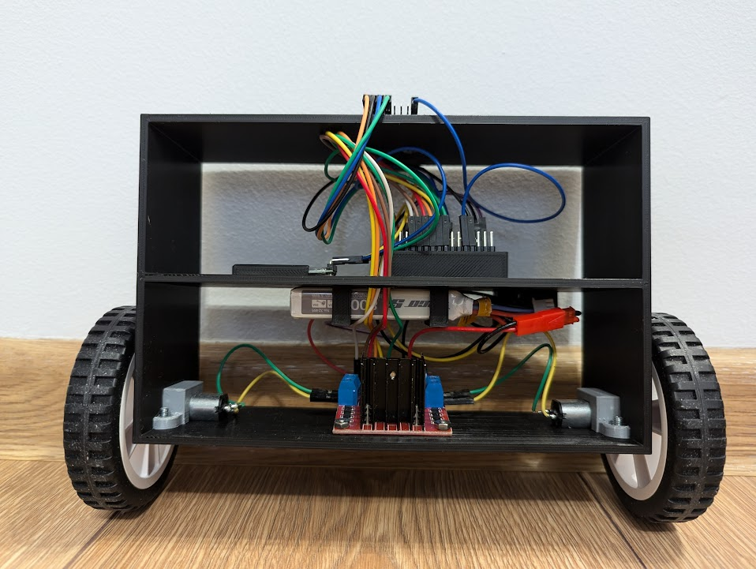

# Self-Balancing Robot Project

This project implements a two-wheeled self-balancing robot controlled via Bluetooth. The robot uses PID control to maintain its balance.

## Components

### Hardware
- Arduino Uno
- MPU6050 (Gyroscope/Accelerometer)
- L298N Motor Driver
- 2x DC Motors with wheels
- HC-05 Bluetooth Module
- 7.4V LiPo Battery
- Chassis components

### Software
- Arduino firmware for robot control
- Android app for remote control

## Features

- Real-time balance stabilization with PID control
- Remote control via Bluetooth
- App-based adjustable PID parameters
- Dynamic movement controls (Forward, Backward, Left, Right)
- Balance point adjustment
- Real-time parameter tuning

## Project Structure

### Arduino Code
- `balancing_robot.ino`: Main robot control code
- `bluetooth_test.ino`: Bluetooth communication test
- `mpu_calibration.ino`: MPU6050 sensor calibration
- `mpu_test.ino`: MPU6050 sensor test

### Android App
- `MainActivity.kt`: Main app interface and Bluetooth control
- `BluetoothDeviceAdapter.kt`: Bluetooth device list adapter
- `activity_main.xml`: App layout
- `strings.xml`: String resources

## How It Works

1. The MPU6050 sensor measures the robot's tilt angle
2. The Arduino processes this data using a PID controller
3. Motor speed is adjusted to maintain balance
4. Bluetooth commands from the Android app can modify:
   - PID parameters (P, I, D values)
   - Balance point
   - Movement direction

## Control Commands

The robot accepts these commands via Bluetooth:
- `F`: Move forward
- `B`: Move backward
- `L`: Turn left
- `R`: Turn right
- `S`: Stop
- `A`: Set balance point
- `P`: Set P value
- `I`: Set I value
- `D`: Set D value

## Default Parameters
- Balance Point: -5.0°
- P: 20
- I: 180
- D: 1.2

## Built Robot

